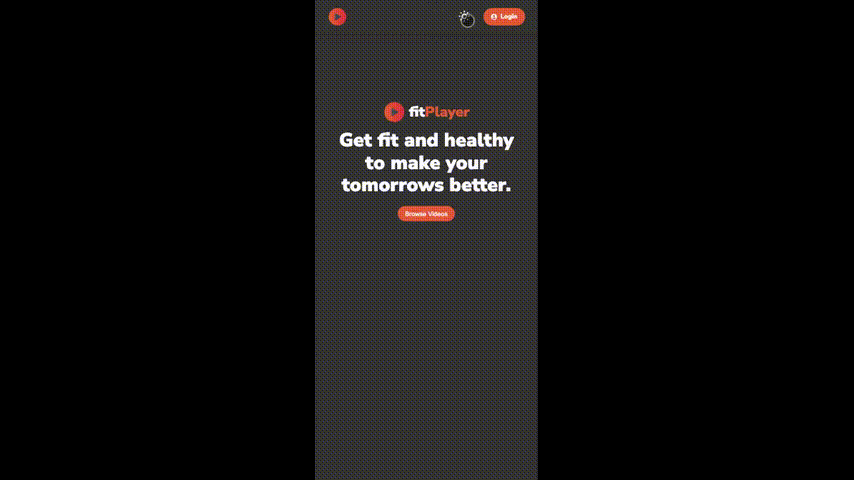

<h1 align="center">
  <br />
  <a href="https://fitplayer.vercel.app/">
  </a>
  <br />
  fitPlayer
  <br />
</h1>

<p align="center">
  <a href="https://github.com/aman11s/fitPlayer/network/members" target="blank">
  
  </a>
  <a href="https://github.com/aman11s/fitPlayer/stargazers" target="blank">
  
  </a>
  <a href="https://github.com/aman11s/fitPlayer/issues" target="blank">
  
  </a>
  <a href="https://github.com/aman11s/fitPlayer/pulls?q=is%3Aopen+is%3Apr" target="blank">
  
  </a>
  <a href="https://github.com/aman11s/fitPlayer/pulls?q=is%3Apr+is%3Aclosed" target="blank">
  
  </a>
</p>
<br />

<h3 align="center">A Video Streaming Platform for fitness freaks</h3>

<hr />
<br />

## **Table of contents**

- [How to run app locally](#how-to-run-app-locally)
- [Preview](#preview)
- [Key Features](#key-features)
- [Tech Stack](#tech-stack)
- [Author](#author)

<hr />
<br />

## **How to run app locally**

```
git clone https://github.com/aman11s/fitPlayer.git
cd fitMart
npm install
npm start
```

<hr />
<br />

## **Preview**

### Desktop preview

<p align="center">
  
</p>

### Mobile preview

<p align="center">
  
</p>

<hr />
<br />

## **Key Features**

- Homepage
- Video listing page
- Filters by Category
- Playlist Management
- Like/ Dislike
- Watch Later
- History
- Authentication
  - Login
  - Logout
  - Signup
- Single Video Page
- Loading and Alerts
- User Profile Page

<hr />
<br />

## **Tech Stack**

- ReactJS
- CSS
- [Mockbee](https://mockbee.netlify.app/) - Mock Backend
- [Colorant UI](https://colorant-ui.netlify.app) - Component Library

<hr />
<br />

## **Author**

- **Portfolio** - [Aman Singh](https://amansingh.netlify.app)
- **Twitter** - [@aman11s](https://twitter.com/aman11s)
- **LinkedIn** - [aman11s](https://www.linkedin.com/in/aman11s)

<hr />
<br />

### **Live project link:** [Click here](https://fitplayer.vercel.app)

<hr />
<br />

### If you like this repository please give it a ⭐ in the top right corner. 😊
